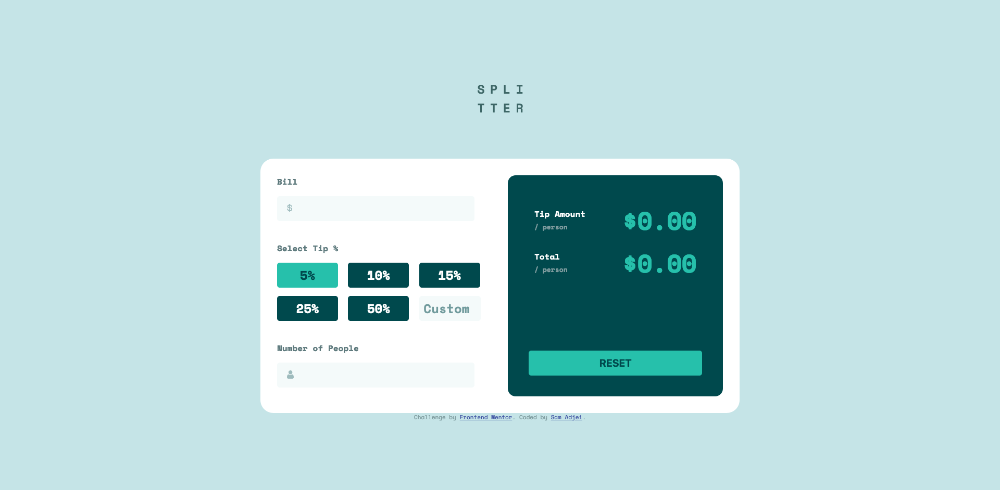

# Frontend Mentor - Tip calculator app solution

This is a solution to the [Tip calculator app challenge on Frontend Mentor](https://www.frontendmentor.io/challenges/tip-calculator-app-ugJNGbJUX). Frontend Mentor challenges help you improve your coding skills by building realistic projects.

## Overview

### The challenge

Users should be able to:

- View the optimal layout for the app depending on their device's screen size
- See hover states for all interactive elements on the page
- Calculate the correct tip and total cost of the bill per person

### Screenshot

### Links

- Solution URL: [Add solution URL here](https://www.frontendmentor.io/solutions/tip-calculator-app-Vp1-OHZPo)
- Live Site URL: [Add live site URL here](https://tip-calculator-app-pi.vercel.app/)

## My process

### Built with

- Semantic HTML5 markup
- CSS custom properties
- Flexbox
- CSS Grid
- Vanilla JavaScript

### What I learned

I undertook this challenge as a way to refresh my understanding of JavaScript. It was really helpful in getting me back to the basics and i enjoyed the challenge it gave me as an entry-level project to improving my vanilla js skills.

## Author

- Website - [Add your name here](https://www.samadjei.com)
- Frontend Mentor - [@samadjei](https://www.frontendmentor.io/profile/samadjei)
- Twitter - [@samkadjei](https://www.twitter.com/samkadjei)
